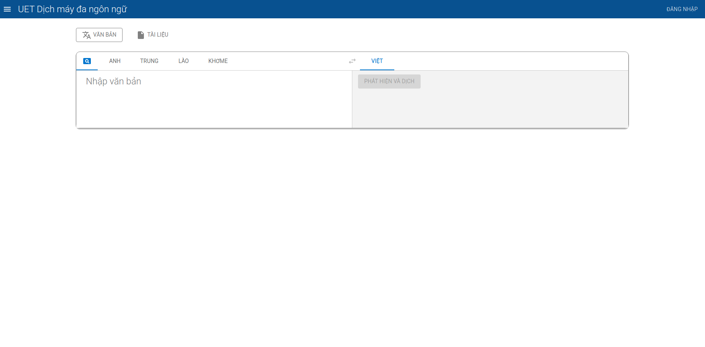

<div id="top"></div>
<!--
*** Thanks for checking out the Best-README-Template. If you have a suggestion
*** that would make this better, please fork the repo and create a pull request
*** or simply open an issue with the tag "enhancement".
*** Don't forget to give the project a star!
*** Thanks again! Now go create something AMAZING! :D
-->


<!-- PROJECT SHIELDS -->
<!--
*** I'm using markdown "reference style" links for readability.
*** Reference links are enclosed in brackets [ ] instead of parentheses ( ).
*** See the bottom of this document for the declaration of the reference variables
*** for contributors-url, forks-url, etc. This is an optional, concise syntax you may use.
*** https://www.markdownguide.org/basic-syntax/#reference-style-links
-->
[![Contributors][contributors-shield]][contributors-url]
[![Forks][forks-shield]][forks-url]
[![Stargazers][stars-shield]][stars-url]
[![Issues][issues-shield]][issues-url]
[![MIT License][license-shield]][license-url]
[![LinkedIn][linkedin-shield]][linkedin-url]


<!-- PROJECT LOGO -->
<br />
<div align="center">
    <a href="https://github.com/KCDichDaNgu/KC4.0_DichDaNgu_FrontEnd">
        
    </a>

  <h3 align="center">KC4.0 dịch đa ngữ (Frontend)</h3>

  <p align="center">
    Tài liệu mô tả chi tiết cách cài đặt, sử dụng phần mềm KC4.0 dịch đa ngữ (phần frontend)
    <br />
    <a href="https://github.com/KCDichDaNgu/KC4.0_DichDaNgu_FrontEnd"><strong>Chi tiết tài liệu »</strong></a>
    <br />
    <br />
    <!-- <a href="https://github.com/KCDichDaNgu/KC4.0_DichDaNgu_FrontEnd">View Demo</a>
    · -->
    <a href="https://github.com/KCDichDaNgu/KC4.0_DichDaNgu_FrontEnd/issues">Báo cáo lỗi</a>
    ·
    <a href="https://github.com/KCDichDaNgu/KC4.0_DichDaNgu_FrontEnd/issues">Yêu cầu tính năng</a>
  </p>
</div>


<!-- TABLE OF CONTENTS -->
<details>
    <summary>Mục lục</summary>
    <ol>
        <li>
            <a href="#giới-thiệu">Giới thiệu</a>
            <ul>
                <li><a href="#công-nghệ">Công nghệ</a></li>
            </ul>
        </li>
        <li>
            <a href="#bắt-đầu">Bắt đầu</a>
            <ul>
                <li><a href="#điều-kiện">Điều kiện</a></li>
                <li><a href="#cài-đặt">Cài đặt</a></li>
            </ul>
        </li>
        <li><a href="#phát-triển">Phát triển</a></li>
        <!-- <li><a href="#roadmap">Roadmap</a></li> -->
        <li><a href="#đóng-góp">Đóng góp</a></li>
        <li><a href="#giấy-phép">Giấy phép</a></li>
        <li><a href="#liên-hệ">Liên hệ</a></li>
        <!-- <li><a href="#acknowledgments">Acknowledgments</a></li> -->
    </ol>
</details>


<!-- ABOUT THE PROJECT -->
## Giới thiệu

<br/>



<br/>
<br/>

Dự án này là một phần của hệ thống <strong>KC4.0 dịch đa ngữ</strong>, đóng vai trò cung cấp giao diện cho người dùng hệ thống. Chi tiết hơn, một số chức năng quan trọng của hệ thống có 
thể kể đến như:
*   Tạo yêu cầu dịch văn bản
*   Tạo yêu cầu dịch tệp, các định dạng tệp được hỗ trợ bao gồm: xlsx, docx, txt, pptx
*   Xem lịch sử dịch
*   Quản lý thông số hệ thống (Đối với Quản trị viên)
*   Quản lý người dùng hệ thống, thiết lập các ngưỡng giới hạn dịch (Đối với Quản trị viên)

<p align="right">(<a href="#top">Trở lại đầu trang</a>)</p>


### Công nghệ

Hệ thống được xây dựng dựa trên những công nghệ dưới đây

*   [NodeJS](https://nodejs.org/)
*   [Yarn](https://yarnpkg.com/)

<p align="right">(<a href="#top">Trở lại đầu trang</a>)</p>


<!-- GETTING STARTED -->
## Bắt đầu

### Điều kiện

Trước khi cài đặt hệ thống, đảm bảo môi trường được thiết lập như sau:
*   Ubuntu 20.04 (Khuyến khích)
*   NodeJS phiên bản >= 16 (Khuyến khích)
*   Yarn phiên bản >= 1.12.0, (Khuyến khích)

Dưới đây là những bước chi tiết để cài đặt hệ thống
*   Cài đặt [Python](https://docs.python-guide.org/starting/install3/linux/) 
*   Cài đặt NodeJS
    ```sh
    curl -o- https://raw.githubusercontent.com/nvm-sh/nvm/v0.39.1/install.sh | bash
    ```
    ```sh
    export NVM_DIR="$([ -z "${XDG_CONFIG_HOME-}" ] && printf %s "${HOME}/.nvm" || printf %s "${XDG_CONFIG_HOME}/nvm")"
    ```
    ```sh
    [ -s "$NVM_DIR/nvm.sh" ] && \. "$NVM_DIR/nvm.sh" # This loads nvm
    ```
    ```sh
    nvm install --lts
    ```
    ```sh
    nvm use --lts
    ```
*   Cài đặt yarn
    ```sh
    npm install -g yarn
    ```

### Cài đặt

1.  Tải repo xuống
    ```sh
    git clone https://github.com/your_username_/KC4.0_DichDaNgu_FrontEnd
    ```
2.  Chuyển hướng vào thư mục của dự án
3.  Cài đặt các gói thư viện
    ```sh
    yarn install
    ```
5.  Tạo tệp chứa biến môi trường dựa trên tệp .env.example
    ```
    cp .env.example .env
    ```
    Sửa các biến quan trọng nếu cần thiết, ví dụ:
    ```yaml
    REACT_APP_CLIENT_ID # Id của google app 
    REACT_APP_SERVER_URL # Đường dẫn đến api backend
    ```
6.  Build dự án
    ```sh
    yarn build
    ```
7.  Sao chép nội dung đã build của dự án vào thư mục /var/www (Trong trường cập cần triển khai)

    ```
    sudo cp -r build/* /var/www/translation_client/
    ```

<p align="right">(<a href="#top">Trở lại đầu trang</a>)</p>


<!-- USAGE EXAMPLES -->
## Phát triển

Để chạy ứng dụng trong môi trường phát triển:
1.  Chuyển hướng vào thư mục dự án
2.  Cài đặt các thư viện cần thiết (Nếu chưa cài)
    ```sh
    yarn install
    ```
2.  Chạy câu lệnh 

    ```sh
    yarn start 
    ```

<p align="right">(<a href="#top">Trở lại đầu trang</a>)</p>


<!-- CONTRIBUTING -->
## Đóng góp

TODO

<p align="right">(<a href="#top">Trở lại đầu trang</a>)</p>


<!-- LICENSE -->
## Giấy phép

TODO

<!-- Distributed under the MIT License. See `LICENSE.txt` for more information. -->

<p align="right">(<a href="#top">Trở lại đầu trang</a>)</p>


<!-- CONTACT -->
## Liên hệ

TODO

<!-- Your Name - [@your_twitter](https://twitter.com/your_username) - email@example.com

Project Link: [https://github.com/your_username/repo_name](https://github.com/your_username/repo_name) -->

<p align="right">(<a href="#top">Trở lại đầu trang</a>)</p>


<!-- MARKDOWN LINKS & IMAGES -->
<!-- https://www.markdownguide.org/basic-syntax/#reference-style-links -->
[contributors-shield]: https://img.shields.io/github/contributors/othneildrew/Best-README-Template.svg?style=for-the-badge
[contributors-url]: https://github.com/KCDichDaNgu/KC4.0_DichDaNgu_FrontEnd/graphs/contributors
[forks-shield]: https://img.shields.io/github/forks/othneildrew/Best-README-Template.svg?style=for-the-badge
[forks-url]: https://github.com/KCDichDaNgu/KC4.0_DichDaNgu_FrontEnd/network/members
[stars-shield]: https://img.shields.io/github/stars/othneildrew/Best-README-Template.svg?style=for-the-badge
[stars-url]: https://github.com/KCDichDaNgu/KC4.0_DichDaNgu_FrontEnd/stargazers
[issues-shield]: https://img.shields.io/github/issues/othneildrew/Best-README-Template.svg?style=for-the-badge
[issues-url]: https://github.com/KCDichDaNgu/KC4.0_DichDaNgu_FrontEnd/issues
[license-shield]: https://img.shields.io/github/license/othneildrew/Best-README-Template.svg?style=for-the-badge
[license-url]: https://github.com/KCDichDaNgu/KC4.0_DichDaNgu_FrontEnd/blob/master/LICENSE.txt
[linkedin-shield]: https://img.shields.io/badge/-LinkedIn-black.svg?style=for-the-badge&logo=linkedin&colorB=555
[linkedin-url]: https://linkedin.com/in/othneildrew
[product-screenshot]: images/screenshot.png
